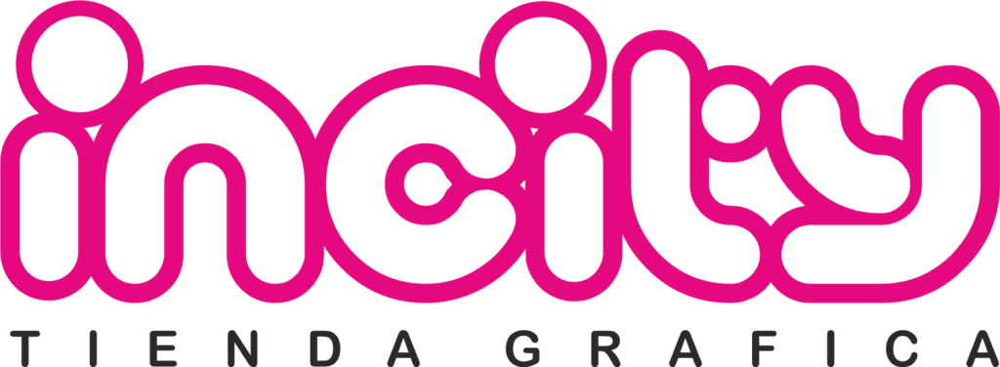
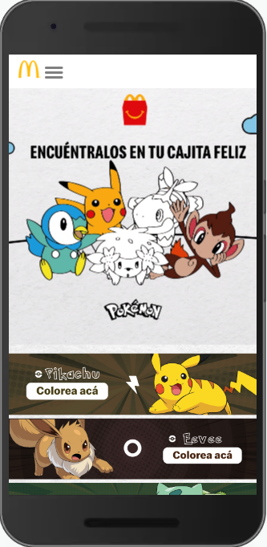
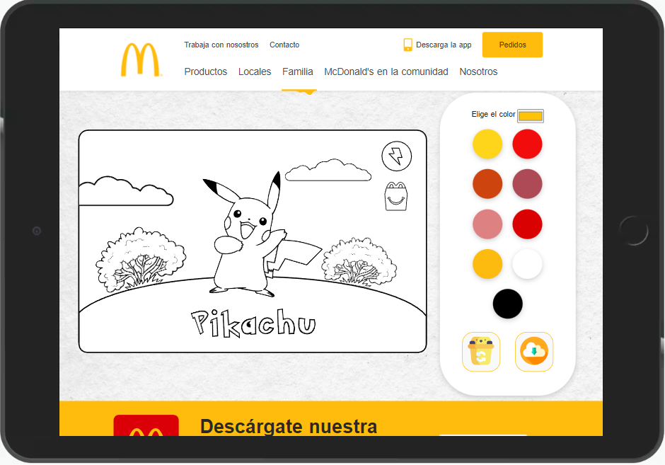
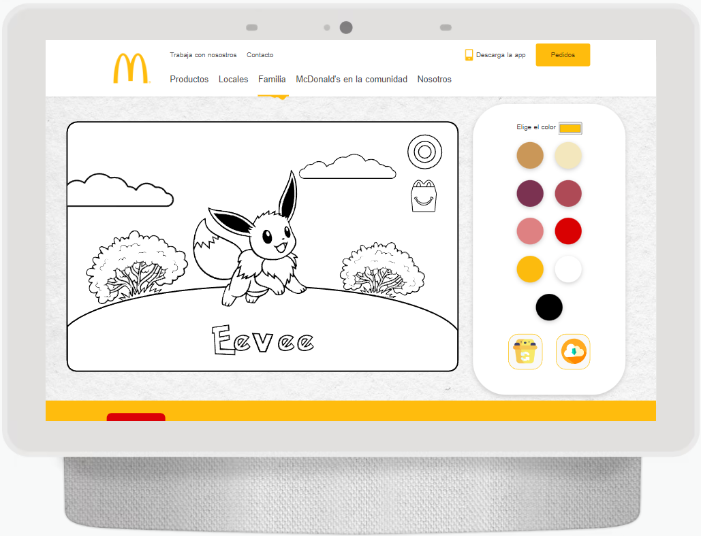

# Proyecto "Pikachu"
`<link>` : https://proyectos-incity.github.io/Proyecto-Pikachu-Julian/

## Cliente: McDonald's Chile
## Campaña Pokémon MC

### Relizado para Incity - Agencia de Diseño

 

 

## Landing Page para McDonald's Chile, sección Cajita Feliz

#### El Cliente solicita:

- Diseño de 10 imágenes en formato SVG
- Diseño de Landing
- Programación en javascript
- El usuario elige 1 de las opciones.*/Colorea a su gusto.
- Boton de Borrado / Resetead
- Botón de descarga de la imagen intervenida

- Fecha de entrega 10 días aprobado el presupuesto.

